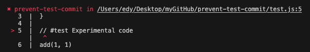
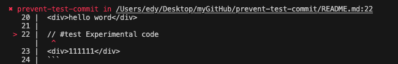
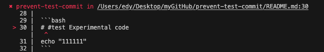

# Introduction

Prohibit submitting test code to git by annotating TODO

## Usage

###

```bash
npm i prevent-test-commit
# or
pnpm add prevent-test-commit
```

You can add comments to your code：

#### javascript

```javascript
function add(a, b) {
  return a + b;
}

// #test Experimental code
add(1, 1);
```

```bash
prevent-test "./test.js"
```



#### html

```html
<div>hello word</div>

// #test Experimental code
<div>111111</div>
```

```bash
prevent-test "./test.html"
```



#### bash

```bash
# #test Experimental code
echo "111111"
```

```bash
prevent-test "./test.sh"
```



### git hook

You can cooperate with git hook and lint-staged to verify before code submission

```json
{
  "pre-commit": ["lint:staged"],
  "lint-staged": {
    "*": ["prevent-test"]
  }
}
```

### API

#### matchAll

```javascript
import { matchAll } from "prevent-test-commit";

// source
matchAll({
  source: `
    // #test 111
    console.log('hello word')
    `,
});
// or file path
matchAll({
  filePath: `./test.js`,
});
```

returns result:

```json
[
  {
    "name": "test",
    "content": "111",
    "source": "",
    "index": 5,
    "filePath": "./test.js"
  }
]
```
